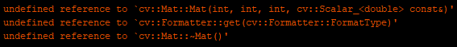

# openCV_ESP32
 Arduino OpenCV library for ESP32 
 
There are a lot of bugs. 
It dosn't work 
DO NOT USED 
DO NOT USED 
DO NOT USED 

Uesd OpenCV 4.5.5 Source Code , modified to be cross-compiled on the ESP32. 
Includes precompile library. 
Simple tested on ESP32-CAM.It doesn't works. 
continuous improvement. 

暂时无法使用。 

把openCV4.5.5源代码下了下来，改了一下交叉编译出来，能在esp32上跑。 
此库仅包含预编译文件和部分头文件。 
初步在ESP32-CAM开发板测试，但是还不能用。 
后期会继续完善。 

