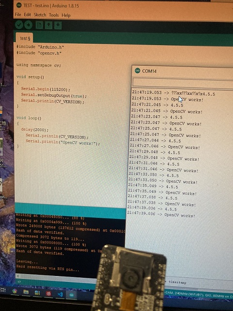

# openCV_ESP32
 Arduino OpenCV library for ESP32

把openCV4.5.5源代码下了下来，改了一下交叉编译出来，能在esp32上跑。
Uesd OpenCV 4.5.5 Source Code , modified to be cross-compiled on the ESP32.
此库仅包含预编译文件和部分头文件。
Includes precompile library.
初步在ESP32-CAM开发板测试，看起来可行。
Simple tested on ESP32-CAM.It looks works.
后期会继续完善。
continuous improvement.

